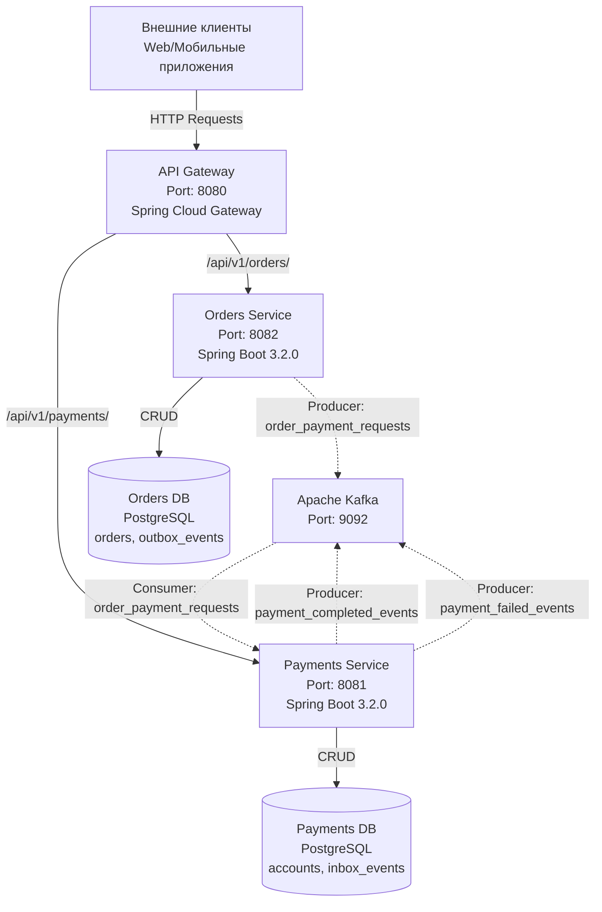
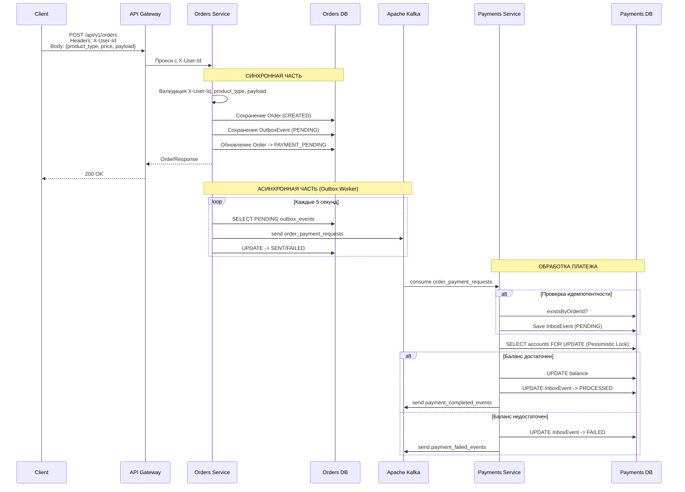

# Итоговый проект по программе

Работу выполнила: `Куликова Алёна Владимировна`.

## Содержание

1. [Документация](#документация)
1. [Задание](#задание)
1. [Общая архитектура системы orbitamarket](#общая-архитектура-системы-orbitamarket)
1. [SQL Аналитика](#sql-аналитика)
1. [Отчет по результатам Allure-тестирования](#отчет-по-результатам-allure-тестирования)
1. [Запуск проекта](#запуск-проекта)

## Документация

> Вся документация располагается по следующему пути [/docs](/docs/).

Назначение [документации о планировании проекта](/docs/01_planning/)

| Документ                                             | Назначение                                                                                                        |
| :--------------------------------------------------- | :---------------------------------------------------------------------------------------------------------------- |
| `01_Planning_OrbitaMarket_project_tasks.md`          | Поэтапный план реализации проекта OrbitaMarket с описанием задач, сроков и ожидаемых результатов каждого этапа    |
| `02_Planned_REST_requests_and_expected_responses.md` | Спецификация всех REST-эндпоинтов с примерами запросов и ожидаемых ответов, включая успешные и ошибочные сценарии |
| `03_Broker_Expected_Events.md`                       | Описание событий брокера сообщений, их структуры и маршрутов публикации и потребления между микросервисами        |
| `04_Planned_order_status.md`                         | Описание жизненного цикла заказа и всех возможных статусов с указанием переходов между ними                       |
| `05_Script_checklist.md`                             | Чек-лист сценариев для ручной и автоматизированной проверки ключевых бизнес-кейсов системы                        |
| `06_Autotest_plan.md`                                | План покрытия автотестами всех эндпоинтов и сквозных сценариев, структура тестового репозитория                   |
| `07_GUI_implementation_plan.md`                      | План дальнейшей разработки графического интерфейса для проекта                                                    |
| `08_Minimum_demonstration_plan_defense.md`           | Минимальный план демонстрации проекта на защите с командами и ожидаемыми результатами                             |

Назначение [документации о архитектуре решения](/docs/02_schemes/)

| Документ                                  | Описание                         | Основные компоненты                                               | Основные технологии                               |
| ----------------------------------------- | -------------------------------- | ----------------------------------------------------------------- | ------------------------------------------------- |
| `OrbitMarket_Schemes_API_Gateway.md`      | Архитектура API Gateway          | Spring Cloud Gateway, WebHandler, RouteLocator, Filters, Actuator | Spring Boot 3.2.0, Spring WebFlux, Reactor, Maven |
| `OrbitMarket_Schemes_API_Tests.md`        | Архитектура тестового фреймворка | BaseTest, PaymentsTest, OrdersTest, ScenariosTest                 | JUnit 5, RestAssured, Allure, Awaitility, Jackson |
| `OrbitMarket_Schemes_Orders_Service.md`   | Архитектура сервиса заказов      | OrderController, OrderService, OutboxWorker, Kafka                | Spring Boot, JPA, PostgreSQL, Kafka               |
| `OrbitMarket_Schemes_Payments_Service.md` | Архитектура сервиса платежей     | AccountController, AccountService, PaymentProcessor, Inbox        | Spring Boot, JPA, Pessimistic Lock, Kafka         |
| `OrbitMarket_Schemes_SQL.md`              | Архитектура SQL аналитики        | 10 SQL файлов с аналитическими запросами                          | PostgreSQL, psql, Docker                          |

Назначение [документации об отчетах](/docs/03_reports/)

# Документация по результатам анализа OrbitaMarket

## Сводная таблица документов

| Документ                                   | Назначение                            | Ключевое содержание                         |
| ------------------------------------------ | ------------------------------------- | ------------------------------------------- |
| `OrbitaMarket_Security_Analysis_Report.md` | Отчет по безопасности кода            | Результаты Semgrep-сканирования             |
| `OrbitaMarket_SQL_Analytics_Report.md`     | Аналитика бизнес-данных               | SQL-запросы по Orders и Payments БД         |
| `OrbitaMarket_Allure_Report.md`            | Отчет по функциональному тестированию | детализация по функциональному тестированию |

## Задание

Задание для итогового проекта по программе располагается в [lms.bmstu.ru](https://lms.bmstu.ru/mod/assign/view.php?id=45972).

## Общая архитектура системы orbitamarket



Поток создания заказа



Все подробности можно прочитать в следующих документах:

- [Архитектура программы API Gateway](/docs/02_schemes/OrbitMarket_Schemes_API_Gateway.md)
- [Архитектура программы Orders Service](/docs/02_schemes/OrbitMarket_Schemes_Orders_Service.md)
- [Архитектура программы Payments Service](/docs/02_schemes/OrbitMarket_Schemes_Payments_Service.md)

## SQL Аналитика

Отчет по выполнению SQL аналитики OrbitaMarket располагается по следующему пути [/docs/03_reports/OrbitaMarket_SQL_Analytics_Report.md](/docs/03_reports/OrbitaMarket_SQL_Analytics_Report.md).

## Отчет по результатам Allure-тестирования

Отчет по результатам Allure-тестирования располагается по следующему пути [/docs/03_reports/OrbitaMarket_Allure_Report.md](/docs/03_reports/OrbitaMarket_Allure_Report.md).

## Отчет по результатам информационной безопасности

Отчет по результатам информационной безопасности располагается по следующему пути [/docs/03_reports/OrbitaMarket_Security_Analysis_Report.md](/docs/03_reports/OrbitaMarket_Security_Analysis_Report.md).

Для данного этапа были взяты правила с [AuroraProudmoore/java-audit-skill](https://github.com/AuroraProudmoore/java-audit-skill/tree/main).

| Категория                | Файл правил              | Количество правил | Основные уязвимости                                                                                                                                                                                                                               |
| ------------------------ | ------------------------ | ----------------- | ------------------------------------------------------------------------------------------------------------------------------------------------------------------------------------------------------------------------------------------------- |
| Критические (P0)         | `java-rce.yaml`          | 21                | RCE: ObjectInputStream, XMLDecoder, XStream, Fastjson, Jackson, Hessian, SnakeYAML; SSTI (Velocity, FreeMarker, Thymeleaf); SpEL/OGNL/MVEL инъекции; JNDI lookup; Runtime.exec/ProcessBuilder команды                                             |
| SQL-инъекции (P1)        | `java-sqli.yaml`         | 6                 | SQLi: Statement.execute\* с конкатенацией строк; MyBatis ${}; JPA/HQL/native запросы с переменными; ORDER BY/IN динамические                                                                                                                      |
| SSRF (P1)                | `java-ssrf.yaml`         | 8                 | SSRF через URL, HttpURLConnection, RestTemplate, WebClient, HttpClient, OkHttp                                                                                                                                                                    |
| Файловые операции (P1)   | `java-file.yaml`         | 14                | Path Traversal: FileInputStream/FileReader/FileOutputStream/FileWriter; Files.readAllBytes/Files.write; upload filename/transferTo; RandomAccessFile                                                                                              |
| Криптография (P2)        | `java-crypto.yaml`       | 8                 | MD5/SHA1, DES/3DES, AES/ECB, java.util.Random, hardcoded secrets, SSL disabled                                                                                                                                                                    |
| Разное (P1/P2)           | `java-misc.yaml`         | 13                | XXE (DocumentBuilder/SAXParser/XMLReader/JAXB/dom4j/JDOM), XSS (response writer/printwriter/JSP), sensitive logging, printStackTrace, permitAll/anonymous, weak BCrypt, session security, Log4Shell                                               |
| Конфигурации (P0/P1/P2)  | `java-config.yaml`       | 12                | Log4j2 JNDI; Spring Security (antMatchers bypass, CSRF, permitAll, HSTS); Actuator expose-all; DevTools; Shiro default key; Swagger/Knife4j; Druid; Fastjson autoType; Nacos; XXL-JOB; JWT hardcoded/weak                                         |
| Микросервисы (P0/P1/P2)  | `java-microservice.yaml` | 16                | Feign (no-auth, SSL), Gateway (no-auth, filter bypass, CORS), Dubbo (insecure serialization, token), gRPC (plaintext), mTLS; NoSQL (MongoDB $where, Elasticsearch script, Redis eval); DB credentials; OWASP Top 10                               |
| API безопасность (P1/P2) | `java-api-security.yaml` | 14                | DELETE/PUT endpoints without auth; batch operations without limit; missing idempotency; sensitive data in response; pagination without limit; missing validation; plaintext password; CORS; open redirect; exception handling                     |
| Новые угрозы (P0/P1/P2)  | `java-emerging.yaml`     | 14                | LLM: hardcoded API keys, prompt injection, LangChain; GraphQL: introspection, depth/batch limits; Kotlin: !! operator, GlobalScope; Java 21: virtual threads, foreign memory; Jakarta EE; concurrency (race conditions, ThreadLocal); idempotency |
| Фронтенд (P0/P1/P2)      | `frontend-config.yaml`   | 12                | CORS wildcard, CSP missing/unsafe-inline/eval, hardcoded keys/secrets/passwords, vulnerable deps, debug mode, sourcemap, localStorage/sessionStorage sensitive, Nginx server_tokens/SSL                                                           |
| JavaScript/TypeScript    | `js-security.yaml`       | 12                | XSS (innerHTML, document.write, eval), DOM XSS (location.hash, location.search), prototype pollution, code injection, insecure random, sensitive info leak                                                                                        |
| React                    | `react-security.yaml`    | 12                | dangerouslySetInnerHTML, href injection, SSR XSS, open redirect, sensitive info leak, insecure refs                                                                                                                                               |
| Vue                      | `vue-security.yaml`      | 12                | v-html XSS, template injection, dynamic components, href injection, open redirect, sensitive info leak                                                                                                                                            |

Данные правила располагаются по следующему пути [rules/semgrep/](./rules/semgrep/).

## Запуск проекта

### Быстрый старт

```
sudo ./run.sh
```

### Ручное управление контейнерами

```
# Остановить все контейнеры и удалить тома
sudo docker-compose down -v

# Запустить все сервисы в фоновом режиме
sudo docker-compose up -d

# Просмотр статуса контейнеров
sudo docker-compose ps

# Просмотр логов всех сервисов
sudo docker-compose logs --tail=50

# Просмотр логов конкретного сервиса
sudo docker-compose logs zookeeper
sudo docker-compose logs kafka
sudo docker-compose logs orders
sudo docker-compose logs payments
sudo docker-compose logs gateway
```

### Тестирование API

Установка утилит (если не установлены)

```
sudo apt-get install jq -y
```

Проверка работоспособности

```
# Проверка API Gateway
curl -s http://localhost:8080/actuator/health | jq .

# Создание аккаунта
curl -X POST http://localhost:8080/api/v1/payments/accounts \
  -H "X-User-Id: test-user" \
  -H "Content-Type: application/json" | jq .

# Пополнение баланса
curl -X POST http://localhost:8080/api/v1/payments/accounts/top-up \
  -H "X-User-Id: test-user" \
  -H "Content-Type: application/json" \
  -d '{"amount": 1000}' | jq .

# Проверка баланса
curl -s http://localhost:8080/api/v1/payments/accounts/balance \
  -H "X-User-Id: test-user" | jq .

# Создание заказа
curl -X POST http://localhost:8080/api/v1/orders \
  -H "X-User-Id: test-user" \
  -H "Content-Type: application/json" \
  -d '{
    "product_type": "ARCHIVE",
    "price": 100,
    "payload": {
      "aoi": "test-area",
      "capture_date": "2024-01-01",
      "sensor_type": "optical"
    }
  }' | jq .

# Просмотр заказов
curl -s http://localhost:8080/api/v1/orders \
  -H "X-User-Id: test-user" | jq .
```
