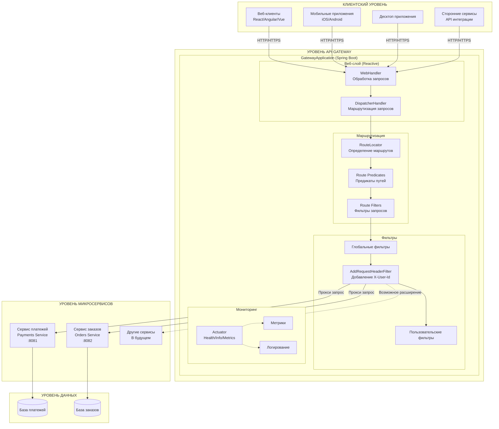
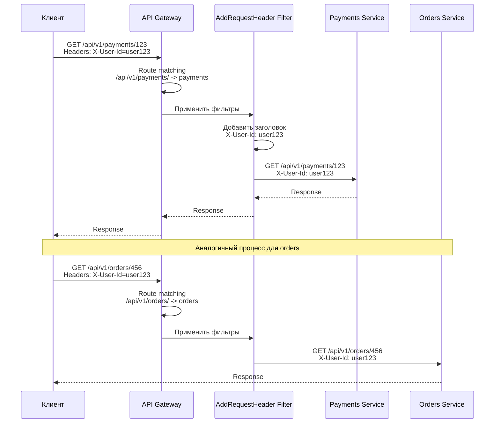
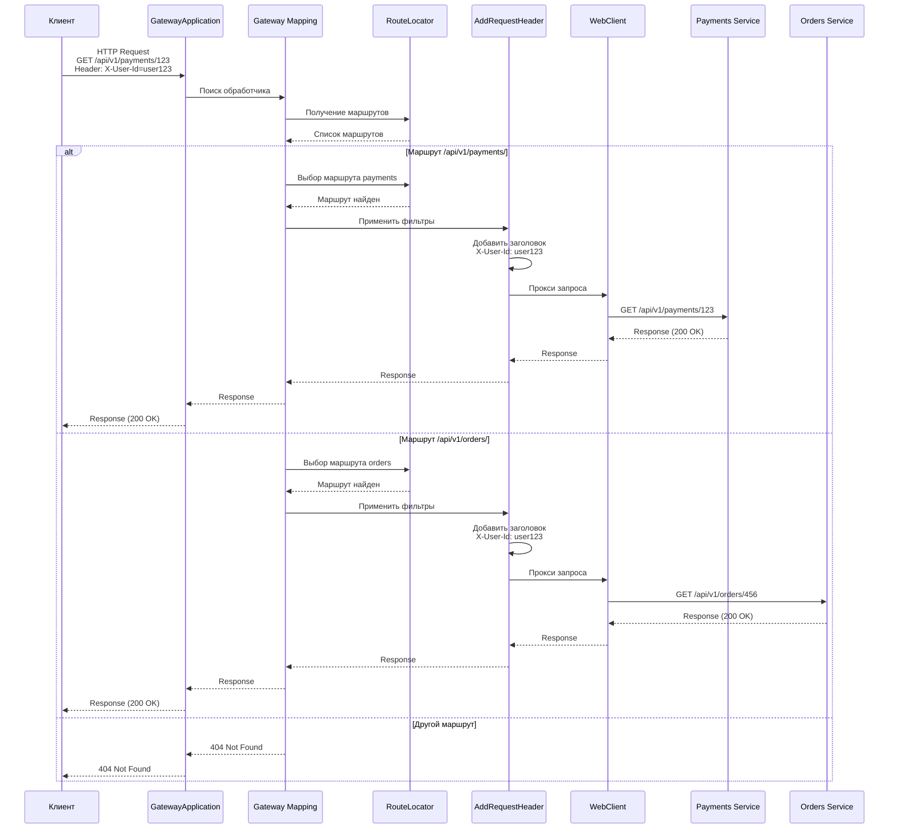

# Архитектура программы API Gateway

## Содержание

1. [Характеристики архитектуры](#характеристики-архитектуры)
1. [Структура приложения](#структура-приложения)
1. [Таблица микросервисов](#таблица-микросервисов)
1. [Таблица баз данных микросервисов](#таблица-баз-данных-микросервисов)
1. [Таблица полного потока обработки запроса в API Gateway](#таблица-полного-потока-обработки-запроса-в-api-gateway)
1. [Поток запроса с фильтрацией](#поток-данных)
1. [Взаимодействие компонентов](#взаимодействие-компонентов)

## Характеристики архитектуры

Технические характеристики

| Компонент    | Технология               | Версия   |
| ------------ | ------------------------ | -------- |
| Framework    | Spring Boot              | 3.2.0    |
| Gateway      | Spring Cloud Gateway     | 2023.0.0 |
| Reactive     | Spring WebFlux / Reactor | -        |
| Java         | OpenJDK                  | 17       |
| Сборка       | Apache Maven             | 3.11.0+  |
| Тестирование | JUnit 5 / Mockito        | -        |

Структура маршрутов

| ID       | Путь                | URI                            | Фильтры          |
| -------- | ------------------- | ------------------------------ | ---------------- |
| payments | `/api/v1/payments/` | `http://payments-service:8081` | AddRequestHeader |
| orders   | `/api/v1/orders/`   | `http://orders-service:8082`   | AddRequestHeader |

Тестовое покрытие

| Тип теста   | Класс             | Аннотации                                                                  | Описание                                |
| ----------- | ----------------- | -------------------------------------------------------------------------- | --------------------------------------- |
| Unit        | SimpleGatewayTest | @SpringBootTest<br/>@ActiveProfiles("test")                                | Проверка маршрутов, предикатов, URI     |
| Integration | GatewayConfigTest | @SpringBootTest<br/>@ActiveProfiles("test")<br/>webEnvironment=RANDOM_PORT | Проверка эндпоинтов, заголовков, health |

Профили

| Профиль | Назначение   | Особенности                       |
| ------- | ------------ | --------------------------------- |
| test    | Тестирование | RANDOM_PORT, discovery disabled   |
| dev     | Разработка   | Локальные настройки               |
| prod    | Продакшен    | Полная конфигурация, безопасность |

Actuator эндпоинты

- `/actuator/health` - Проверка здоровья
- `/actuator/info` - Информация о приложении

## Структура приложения



### Описание

#### КЛИЕНТСКИЙ УРОВЕНЬ

Этот уровень представляет всех потребителей API, которые взаимодействуют с системой

#### УРОВЕНЬ API GATEWAY

Центральный компонент системы, построенный на Spring Boot и Spring Cloud Gateway

Веб-слой

| Компонент         | Роль                                           | Ключевые особенности                                                                                                                                           | Технические детали                                                                                                                                                                |
| ----------------- | ---------------------------------------------- | -------------------------------------------------------------------------------------------------------------------------------------------------------------- | --------------------------------------------------------------------------------------------------------------------------------------------------------------------------------- |
| WebHandler        | Точка входа для всех HTTP запросов             | • Работает на реактивном стеке (Project Reactor)<br/>• Неблокирующая обработка<br/>• Асинхронная обработка<br/>• Поддержка высоких нагрузок (non-blocking I/O) | Код:<br/>`public Mono<Response> handleRequest(ServerWebExchange exchange)`<br/><br/>Поток:<br/>Получение запроса -> Обработка тела -> Маршрутизация                               |
| DispatcherHandler | Диспетчер, направляющий запросы к обработчикам | • Анализ URL и HTTP методов<br/>• Сопоставление с зарегистрированными маршрутами<br/>• Применение глобальных фильтров                                          | Процесс:<br/>1. Получение запроса от WebHandler<br/>2. Проверка пути запроса<br/>3. Поиск соответствующего Route<br/>4. Применение фильтров маршрута<br/>5. Проксирование запроса |

Маршрутизация

| Компонент       | Роль                                            | Реализация                                                              | Методы/Функции                                                                                                                                                                         |
| --------------- | ----------------------------------------------- | ----------------------------------------------------------------------- | -------------------------------------------------------------------------------------------------------------------------------------------------------------------------------------- |
| RouteLocator    | Хранит и управляет конфигурацией маршрутов      | GatewayConfig.java<br/>`@Bean public RouteLocator customRouteLocator()` | • Определение маршрутов<br/>• Настройка предикатов<br/>• Применение фильтров                                                                                                           |
| RoutePredicates | Условия для сопоставления запросов с маршрутами | Встроенные и кастомные предикаты                                        | • Path: совпадение по пути URL<br/>• Method: HTTP метод<br/>• Header: наличие/значение заголовка<br/>• Query: параметры запроса<br/>• Host: хост запроса<br/>• Cookie: значение cookie |
| RouteFilters    | Модифицируют запросы до проксирования           | GatewayFilter Factory                                                   | См. таблицу фильтров ниже                                                                                                                                                              |

Конфигурация маршрутов

| Маршрут  | Путь                | Фильтры                     | URI                            | Описание                         |
| -------- | ------------------- | --------------------------- | ------------------------------ | -------------------------------- |
| payments | `/api/v1/payments/` | AddRequestHeader: X-User-Id | `http://payments-service:8081` | Маршрутизация платежных запросов |
| orders   | `/api/v1/orders/`   | AddRequestHeader: X-User-Id | `http://orders-service:8082`   | Маршрутизация запросов заказов   |

Типы предикатов

| Тип     | Описание                 | Пример кода                    |
| ------- | ------------------------ | ------------------------------ |
| Path    | Совпадение по пути URL   | `.path("/api/v1/payments/")`   |
| Method  | HTTP метод               | `.method(HttpMethod.GET)`      |
| Header  | Заголовок с regex        | `.header("X-User-Id", "\\d+")` |
| Query   | Параметр запроса         | `.query("page", "\\d+")`       |
| Host    | Хост запроса             | `.host(".api.domain.com")`     |
| Cookie  | Значение cookie          | `.cookie("SESSION", ".*")`     |
| Before  | До указанного времени    | `.before(ZonedDateTime.now())` |
| After   | После указанного времени | `.after(ZonedDateTime.now())`  |
| Between | Между временами          | `.between(start, end)`         |

Фильтры маршрутов

| Тип фильтра         | Описание                  | Пример использования                                      | Назначение                      |
| ------------------- | ------------------------- | --------------------------------------------------------- | ------------------------------- |
| AddRequestHeader    | Добавление заголовка      | `.addRequestHeader("X-User-Id", "${header.X-User-Id}")`   | Передача контекста пользователя |
| AddRequestParameter | Добавление параметра      | `.addRequestParameter("source", "gateway")`               | Добавление служебных параметров |
| RemoveRequestHeader | Удаление заголовка        | `.removeRequestHeader("Authorization")`                   | Безопасность                    |
| SetPath             | Изменение пути            | `.setPath("/api/v2/{segment}")`                           | Версионирование API             |
| RewritePath         | Перезапись пути           | `.rewritePath("/old/(?<segment>.*)", "/new/$ {segment}")` | Миграция маршрутов              |
| PrefixPath          | Добавление префикса       | `.prefixPath("/api")`                                     | Группировка эндпоинтов          |
| CircuitBreaker      | Защита от сбоев           | `.circuitBreaker(config)`                                 | Отказоустойчивость              |
| Retry               | Повторные попытки         | `.retry(config)`                                          | Временные ошибки                |
| RequestRateLimiter  | Ограничение запросов      | `.requestRateLimiter(config)`                             | DDoS защита                     |
| StripPrefix         | Удаление префикса         | `.stripPrefix(1)`                                         | Упрощение маршрутов             |
| PreserveHostHeader  | Сохранение Host заголовка | `.preserveHostHeader()`                                   | Проксирование                   |

Фильтры

| Компонент              | Роль                                  | Функции                                                                                                                              | Пример кода                                                                                                                    |
| ---------------------- | ------------------------------------- | ------------------------------------------------------------------------------------------------------------------------------------ | ------------------------------------------------------------------------------------------------------------------------------ |
| GlobalFilters          | Применяются ко всем запросам          | • Логирование запросов/ответов<br/>• Аутентификация<br/>• Трассировка (Distributed Tracing)<br/>• CORS настройки<br/>• Rate Limiting | `@Component`<br/>`public class GlobalLoggingFilter implements GlobalFilter`<br/>`{ log.info("Request: {} {}", method, URI); }` |
| AddRequestHeaderFilter | Добавляет X-User-Id в заголовок       | • Передача контекста пользователя<br/>• Аудит действий<br/>• Персонализация                                                          | Формат:<br/>`X-User-Id: ${header.X-User-Id}`<br/>Проксирует оригинальный заголовок                                             |
| CustomFilters          | Специфичные фильтры для бизнес-логики | • Валидация JWT токенов<br/>• Трансформация ответов<br/>• Кеширование<br/>• Маскировка данных                                        | Создается через `@Bean` или `AbstractGatewayFilterFactory`                                                                     |

Мониторинг

| Компонент | Роль                                            | Ключевые особенности                           |
| --------- | ----------------------------------------------- | ---------------------------------------------- |
| Actuator  | Предоставляет информацию о состоянии приложения | Spring Boot Actuator эндпоинты для мониторинга |

Actuator эндпоинты

| Эндпоинт            | Описание                   | Использование              | Пример ответа                                          |
| ------------------- | -------------------------- | -------------------------- | ------------------------------------------------------ |
| `/actuator/health`  | Статус здоровья            | Проверка работоспособности | `{ "status": "UP" }`                                   |
| `/actuator/info`    | Информация о приложении    | Версия, сборка             | `{ "app": { "version": "1.0.0" } }`                    |
| `/actuator/metrics` | Метрики производительности | CPU, память, запросы       | `{ "name": "jvm.memory.used", "measurements": [...] }` |
| `/actuator/env`     | Переменные окружения       | Конфигурация               | `{ "activeProfiles": ["test"] }`                       |
| `/actuator/gateway` | Информация о маршрутах     | Статус маршрутов           | Список всех маршрутов                                  |
| `/actuator/loggers` | Уровни логирования         | Настройка логирования      | `{ "levels": ["INFO", "DEBUG"] }`                      |

Метрики

| Категория    | Метрики                                                                                | Описание                      |
| ------------ | -------------------------------------------------------------------------------------- | ----------------------------- |
| Запросы      | • RPS (Requests Per Second)<br/>• Общее количество запросов<br/>• Запросы по статусам  | Производительность и нагрузка |
| Время ответа | • P50 (медиана)<br/>• P95<br/>• P99<br/>• Максимальное время                           | Качество обслуживания         |
| Ошибки       | • 4xx ошибки<br/>• 5xx ошибки<br/>• Процент ошибок                                     | Стабильность системы          |
| Системные    | • Использование CPU<br/>• Использование памяти<br/>• Количество потоков<br/>• GC время | Ресурсы системы               |

Логирование

| Уровень | Описание                 | Использование                                |
| ------- | ------------------------ | -------------------------------------------- |
| ERROR   | Критические ошибки       | Ошибки, требующие немедленного вмешательства |
| WARN    | Предупреждения           | Потенциальные проблемы                       |
| INFO    | Информационные сообщения | Бизнес-события, старт/стоп приложения        |
| DEBUG   | Отладочная информация    | Разработка и локальное тестирование          |
| TRACE   | Детальная трассировка    | Глубокое логирование потоков данных          |

Настройка логирования

```properties
# application.properties
logging.level.com.orbitamarket.gateway=INFO
logging.level.org.springframework.cloud.gateway=WARN
logging.level.reactor.netty=INFO

# Файловое логирование
logging.file.name=logs/gateway.log
logging.logback.rollingpolicy.max-history=30
logging.logback.rollingpolicy.total-size-cap=10GB
```

#### УРОВЕНЬ МИКРОСЕРВИСОВ

## Таблица микросервисов

| Компонент                            | Порт | Назначение                   | Основные функции                                                                                                                                                                               | Взаимодействие с Gateway                                                                                                                                                        |
| ------------------------------------ | ---- | ---------------------------- | ---------------------------------------------------------------------------------------------------------------------------------------------------------------------------------------------- | ------------------------------------------------------------------------------------------------------------------------------------------------------------------------------- |
| PaymentService<br/>(Сервис платежей) | 8081 | Обработка платежных операций | • Создание платежей<br/>• Проверка статуса платежа<br/>• Возвраты и отмены<br/>• Интеграция с платежными шлюзами<br/>• Обработка вебхуков от платежных систем<br/>• Валидация платежных данных | Маршрут: `/api/v1/payments/`<br/>Заголовки: X-User-Id<br/>Пример запроса:<br/>`POST /api/v1/payments`<br/>`GET /api/v1/payments/{id}`<br/>`DELETE /api/v1/payments/{id}/cancel` |
| OrderService<br/>(Сервис заказов)    | 8082 | Управление заказами          | • Создание заказов<br/>• Обновление статуса<br/>• История заказов<br/>• Управление корзиной<br/>• Расчет стоимости доставки<br/>• Применение скидок и промокодов                               | Маршрут: `/api/v1/orders/`<br/>Заголовки: X-User-Id<br/>Пример запроса:<br/>`POST /api/v1/orders`<br/>`GET /api/v1/orders/{id}`<br/>`PUT /api/v1/orders/{id}/status`            |

#### УРОВЕНЬ ДАННЫХ

## Таблица баз данных микросервисов

| Компонент                     | Тип БД                                                                 | Основные сущности                                                                 | Поля/Данные                                                                                                                                                                                                                                                                                                                                                                                                                                             | Ключевые операции                                                                                                                | Связи с другими сервисами                                                                                                                                                   |
| ----------------------------- | ---------------------------------------------------------------------- | --------------------------------------------------------------------------------- | ------------------------------------------------------------------------------------------------------------------------------------------------------------------------------------------------------------------------------------------------------------------------------------------------------------------------------------------------------------------------------------------------------------------------------------------------------- | -------------------------------------------------------------------------------------------------------------------------------- | --------------------------------------------------------------------------------------------------------------------------------------------------------------------------- |
| PaymentDB<br/>(База платежей) | Реляционная (PostgreSQL, MySQL)<br/>или<br/>NoSQL (MongoDB, Cassandra) | • Транзакции<br/>• Платежные методы<br/>• История операций<br/>• Статусы платежей | Транзакции:<br/>- id (PK)<br/>- order_id (FK)<br/>- user_id<br/>- amount<br/>- currency<br/>- status (PENDING, SUCCESS, FAILED, CANCELLED)<br/>- payment_method_id<br/>- transaction_date<br/>- gateway_response<br/><br/>Платежные методы:<br/>- id (PK)<br/>- user_id<br/>- type (CARD, WALLET, CRYPTO)<br/>- token<br/>- is_default<br/>- created_at                                                                                                 | • Создание платежа<br/>• Обновление статуса<br/>• Возврат средств<br/>• История транзакций<br/>• Списание/начисление             | • OrderService - по order_id<br/>• UserService - по user_id<br/>• Платежные шлюзы - внешняя интеграция                                                                      |
| OrderDB<br/>(База заказов)    | Реляционная (PostgreSQL, MySQL)<br/>или<br/>NoSQL (MongoDB, Cassandra) | • Заказы<br/>• Товары в заказе<br/>• Статусы заказов<br/>• История изменений      | Заказы:<br/>- id (PK)<br/>- user_id<br/>- total_amount<br/>- status (NEW, PROCESSING, SHIPPED, DELIVERED, CANCELLED)<br/>- created_at<br/>- updated_at<br/>- shipping_address<br/>- delivery_type<br/><br/>Товары в заказе:<br/>- id (PK)<br/>- order_id (FK)<br/>- product_id<br/>- quantity<br/>- price<br/>- total<br/><br/>История изменений:<br/>- id (PK)<br/>- order_id (FK)<br/>- status_from<br/>- status_to<br/>- changed_by<br/>- changed_at | • Создание заказа<br/>• Обновление статуса<br/>• Добавление/удаление товаров<br/>• Расчет итоговой суммы<br/>• Применение скидок | • PaymentService - для создания платежа<br/>• UserService - по user_id<br/>• InventoryService - для резервирования товаров<br/>• DeliveryService - для организации доставки |

#### ПОТОК ДАННЫХ

## Таблица полного потока обработки запроса в API Gateway

| Этап | Название                                     | Участники                         | Действие                                                                            | Входные данные                                                                                                          | Выходные данные                             | Ключевые особенности                                                                                                                                               |
| ---- | -------------------------------------------- | --------------------------------- | ----------------------------------------------------------------------------------- | ----------------------------------------------------------------------------------------------------------------------- | ------------------------------------------- | ------------------------------------------------------------------------------------------------------------------------------------------------------------------ |
| 1    | Клиент отправляет запрос к WebHandler        | Клиент -> WebHandler              | Клиентское приложение инициирует HTTP/HTTPS запрос к API Gateway                    | • HTTP метод (GET, POST, PUT, DELETE)<br/>• URL путь<br/>• Заголовки запроса<br/>• Тело запроса<br/>• Параметры запроса | HTTP запрос, переданный в WebHandler        | • WebHandler - точка входа в систему<br/>• Принимает все входящие запросы<br/>• Поддерживает реактивную обработку<br/>• Обрабатывает CORS политики                 |
| 2    | WebHandler передает запрос DispatcherHandler | WebHandler -> DispatcherHandler   | WebHandler передает запрос диспетчеру для дальнейшей обработки                      | HTTP запрос от клиента                                                                                                  | Запрос, подготовленный для маршрутизации    | • Начальный анализ запроса<br/>• Подготовка к маршрутизации<br/>• Проверка базовых параметров<br/>• Инициализация контекста обработки                              |
| 3    | DispatcherHandler обращается к RouteLocator  | DispatcherHandler -> RouteLocator | DispatcherHandler запрашивает список зарегистрированных маршрутов                   | Запрос от WebHandler                                                                                                    | Список доступных маршрутов с конфигурацией  | • Получение всех маршрутов<br/>• Конфигурация путей и фильтров<br/>• Определение целевых URI<br/>• Управление приоритетами маршрутов                               |
| 4    | RouteLocator проверяет предикаты пути        | RouteLocator -> RoutePredicates   | Система последовательно проверяет зарегистрированные предикаты для каждого маршрута | Список маршрутов + входящий запрос                                                                                      | Определенный маршрут для обработки запроса  | • Проверка пути URL<br/>• Проверка HTTP метода<br/>• Проверка заголовков<br/>• Проверка параметров запроса<br/>• Проверка хоста и cookie                           |
| 5    | Применение фильтров маршрута                 | RouteFilters -> Маршрут           | Применение фильтров, определенных для конкретного маршрута                          | Запрос + определенный маршрут                                                                                           | Модифицированный запрос                     | • Добавление заголовков<br/>• Изменение пути запроса<br/>• Добавление параметров<br/>• Применение специфичных правил<br/>• Трансформация тела запроса              |
| 6    | Применение глобальных фильтров               | GlobalFilters -> Весь запрос      | Применение глобальных фильтров ко всем запросам независимо от маршрута              | Модифицированный запрос                                                                                                 | Запрос с примененными глобальными фильтрами | • Логирование запросов/ответов<br/>• Аутентификация и авторизация<br/>• Трассировка распределенных систем<br/>• Настройка CORS<br/>• Ограничение частоты запросов  |
| 7    | Добавление заголовка X-User-Id               | AddHeaderFilter -> Запрос         | AddHeaderFilter добавляет заголовок X-User-Id в запрос                              | Запрос с глобальными фильтрами                                                                                          | Запрос с добавленным заголовком X-User-Id   | • Передача контекста пользователя<br/>• Аудит действий пользователя<br/>• Персонализация запросов<br/>• Сквозное логирование<br/>• Безопасность на уровне сервисов |
| 8    | Проксирование запроса к целевому сервису     | Gateway -> Целевой сервис         | Gateway проксирует подготовленный запрос к соответствующему микросервису            | Запрос с заголовками + URI целевого сервиса                                                                             | Проксированный запрос к микросервису        | • Перенаправление на указанный URI<br/>• Сохранение всех заголовков<br/>• Применение модификаций пути<br/>• Балансировка нагрузки<br/>• Обработка таймаутов        |
| 9    | Микросервис выполняет операции с БД          | Микросервис -> База данных        | Целевой микросервис выполняет операции с базой данных                               | Запрос от Gateway                                                                                                       | Выполненная операция БД (чтение/запись)     | • Чтение данных (SELECT)<br/>• Создание записей (INSERT)<br/>• Обновление данных (UPDATE)<br/>• Удаление данных (DELETE)<br/>• Транзакционные операции             |
| 10   | База данных возвращает данные сервису        | База данных -> Микросервис        | База данных обрабатывает запрос и возвращает данные микросервису                    | Запрос к БД                                                                                                             | Результат операции БД                       | • Возврат запрошенных данных<br/>• Подтверждение операции<br/>• Проверка целостности данных<br/>• Транзакционные гарантии<br/>• Обработка ошибок БД                |
| 11   | Микросервис формирует ответ для Gateway      | Микросервис -> Gateway            | Микросервис формирует структурированный HTTP ответ                                  | Результат из БД                                                                                                         | HTTP ответ для Gateway                      | • Формирование статусного кода<br/>• Добавление заголовков ответа<br/>• Структурирование тела ответа<br/>• Сериализация данных (JSON/XML)<br/>• Логирование ответа |
| 12   | Gateway возвращает ответ клиенту             | Gateway -> Клиент                 | Gateway получает ответ, применяет пост-фильтры и возвращает клиенту                 | HTTP ответ от микросервиса                                                                                              | Финальный HTTP ответ клиенту                | • Применение пост-фильтров<br/>• Трансформация ответа<br/>• Форматирование ошибок<br/>• Добавление заголовков<br/>• Возврат клиентскому приложению                 |

## Поток запроса с фильтрацией



### Описание

#### Сценарий 1. Запрос к сервису платежей

Клиентское приложение отправляет запрос на получение информации о платеже с идентификатором 123. Запрос направляется на адрес API Gateway: GET /api/v1/payments/123. Вместе с запросом клиент передает заголовок X-User-Id со значением user123, который идентифицирует пользователя.

Когда запрос достигает API Gateway, система определяет, что путь /api/v1/payments/ соответствует маршруту для сервиса платежей. Gateway находит соответствующее правило маршрутизации и понимает, что этот запрос нужно направить в Payments Service.

Перед отправкой запроса в микросервис, Gateway применяет настроенные фильтры. В данном случае фильтр AddRequestHeader берет значение заголовка X-User-Id из оригинального запроса клиента и добавляет его в запрос, который будет отправлен в микросервис. Это гарантирует, что контекст пользователя сохраняется на всем пути обработки запроса.

Затем Gateway проксирует запрос в Payments Service на адрес http://payments-service:8081/api/v1/payments/123. Заголовок X-User-Id со значением user123 передается вместе с запросом. Payments Service обрабатывает запрос и возвращает ответ с данными о платеже. Этот ответ проходит обратный путь через Gateway и возвращается клиенту.

#### Сценарий 2. Запрос к сервису заказов

Для запросов к сервису заказов процесс выглядит аналогично. Клиент отправляет запрос на получение заказа с идентификатором 456: GET /api/v1/orders/456. Заголовок X-User-Id снова содержит идентификатор пользователя user123.

API Gateway анализирует путь запроса и определяет, что /api/v1/orders/ соответствует маршруту для сервиса заказов. Система применяет те же фильтры, включая добавление заголовка X-User-Id, и проксирует запрос в OrderService.

OrderService получает запрос на адресе http://orders-service:8082/api/v1/orders/456 вместе с заголовком X-User-Id. Сервис обрабатывает запрос и возвращает данные о заказе. Ответ также проходит через Gateway и возвращается клиенту.

#### Особенности этого взаимодействия

- Клиентское приложение не знает о существовании отдельных микросервисов. Оно взаимодействует только с API Gateway, который выступает как единая точка входа в систему.
- Все запросы проходят через одинаковый набор фильтров, что обеспечивает единообразие в обработке заголовков, аутентификации и других кросс-функциональных задач.
- Благодаря добавлению заголовка X-User-Id в каждый запрос, все микросервисы могут идентифицировать пользователя и применять соответствующие правила доступа и персонализации.
- Gateway определяет целевой сервис на основе пути запроса, что позволяет легко добавлять новые сервисы и изменять конфигурацию маршрутов без изменения клиентского кода.
- Централизованная обработка заголовков и фильтрация запросов позволяет применять единые политики безопасности для всех микросервисов.

## Взаимодействие компонентов



### Опиисание

API Gateway как центральный диспетчерский пункт, который принимает все входящие запросы от клиентов и направляет их в нужные микросервисы. Этот процесс можно разделить на несколько логических шагов.

1. Клиентское приложение отправляет HTTP запрос к API Gateway. В нашем примере это запрос на получение данных о платеже: GET /api/v1/payments/123. Вместе с запросом клиент передает заголовок X-User-Id со значением user123, который идентифицирует пользователя.
1. GatewayApplication принимает запрос от клиента. Это точка входа в систему, где начинается обработка каждого запроса.
1. GatewayApplication передает запрос компоненту Gateway Mapping, который отвечает за поиск подходящего обработчика для данного запроса.
1. Gateway Mapping обращается к RouteLocator, чтобы получить список всех зарегистрированных маршрутов. RouteLocator хранит конфигурацию всех доступных маршрутов в системе.
1. RouteLocator возвращает список маршрутов, и система начинает проверять, какой маршрут соответствует входящему запросу. В нашем примере проверяются два основных маршрута: для платежей и для заказов.
1. Если запрос соответствует маршруту /api/v1/payments/, система выбирает маршрут payments. Этот маршрут настроен на направление запросов в Payments Service.
1. Перед отправкой запроса в микросервис, Gateway применяет фильтры. В данном случае фильтр AddRequestHeader берет значение заголовка X-User-Id из оригинального запроса и добавляет его в запрос, который будет отправлен в микросервис. Это гарантирует, что контекст пользователя сохраняется на всем пути обработки.
1. После применения фильтров, Gateway проксирует запрос через WebClient в целевой сервис. Запрос направляется в Payments Service по адресу, указанному в конфигурации маршрута.
1. Payments Service получает запрос, обрабатывает его и возвращает ответ. В примере это успешный ответ с кодом 200 OK.
1. Ответ от микросервиса проходит обратный путь через всю цепочку: от Payments Service через WebClient, фильтры, Gateway Mapping и обратно к клиенту. Клиент получает запрошенные данные о платеже.

Если клиент отправляет запрос по пути, который не соответствует ни одному из зарегистрированных маршрутов, система возвращает ошибку 404 Not Found. Это означает, что запрошенный ресурс не существует в системе.

Преимущества представленного подхода:

1. Клиент работает только с API Gateway и не знает о существовании отдельных микросервисов. Это упрощает клиентскую часть и делает систему более гибкой.
1. Все запросы проходят через единую точку, где можно применять общие правила: аутентификацию, логирование, добавление заголовков, ограничение частоты запросов и другие кросс-функциональные задачи.
1. Система легко масштабируется. Если нужно добавить новый микросервис, достаточно добавить новый маршрут в конфигурацию Gateway, и клиенты смогут обращаться к нему без изменений в своем коде.
1. Обеспечивается безопасность. Все запросы проходят через централизованный контроль, где можно проверять права доступа, валидировать заголовки и применять политики безопасности.
