# Архитектура программы OrbitMarket API Tests

```mermaid
graph TB
    subgraph "Тестовое окружение"
        subgraph "Тестируемые сервисы"
            PaymentsService[Payments Service<br/>http://localhost:8080]
            OrdersService[Orders Service<br/>http://localhost:8080]
            KafkaBroker[Kafka Broker<br/>kafka:9092]
            PostgresDB[(PostgreSQL<br/>accounts, orders)]
        end

        subgraph "Тестовый фреймворк"
            Tests[JUnit 5 Tests]

            subgraph "Слои тестов"
                Base[BaseTest<br/>Настройка RestAssured<br/>Генерация userId]

                subgraph "Тестовые классы"
                    PaymentsTest[PaymentsTest<br/>Тесты платежей<br/>Создание счета<br/>Пополнение<br/>Баланс]
                    OrdersTest[OrdersTest<br/>Тесты заказов<br/>Создание<br/>Получение]
                    ScenariosTest[ScenariosTest<br/>End-to-end сценарии<br/>Happy Path<br/>Недостаточно средств<br/>Множественные заказы]
                end
            end

            subgraph "Инструменты тестирования"
                RestAssured[RestAssured<br/>HTTP клиент]
                Allure[Allure<br/>Отчетность]
                Awaitility[Awaitility<br/>Асинхронное ожидание]
                Jackson[Jackson<br/>JSON сериализация]
            end
        end
    end

    %% Связи между слоями тестов
    PaymentsTest -->|Наследуется от| Base
    OrdersTest -->|Наследуется от| Base
    ScenariosTest -->|Наследуется от| Base

    %% Используемые инструменты
    PaymentsTest -.->|Использует| RestAssured
    OrdersTest -.->|Использует| RestAssured
    ScenariosTest -.->|Использует| RestAssured
    ScenariosTest -.->|Использует| Awaitility
    Tests -.->|Генерирует отчет| Allure

    %% Взаимодействие с тестируемыми сервисами
    RestAssured -->|HTTP запросы| PaymentsService
    RestAssured -->|HTTP запросы| OrdersService

    PaymentsService -->|Запросы к БД| PostgresDB
    OrdersService -->|Запросы к БД| PostgresDB

    PaymentsService -->|Consumer/Producer| KafkaBroker
    OrdersService -->|Consumer/Producer| KafkaBroker

    %% Тест-кейсы
    subgraph "Тестовые сценарии"
        TC1["TC: Создание счета"]
        TC2["TC: Пополнение баланса"]
        TC3["TC: Получение баланса"]
        TC4["TC: Валидация полей"]
        TC5["TC: Обработка ошибок"]
        TC6["TC: Happy Path"]
        TC7["TC: Insufficient Balance"]
        TC8["TC: Multiple Orders"]
    end

    PaymentsTest -.-> TC1
    PaymentsTest -.-> TC2
    PaymentsTest -.-> TC3
    PaymentsTest -.-> TC4
    PaymentsTest -.-> TC5

    ScenariosTest -.-> TC6
    ScenariosTest -.-> TC7
    ScenariosTest -.-> TC8


    class PaymentsTest,OrdersTest,ScenariosTest,Base testClass
    class RestAssured,Allure,Awaitility,Jackson tool
    class PaymentsService,OrdersService,KafkaBroker service
    class PostgresDB database
    class TC1,TC2,TC3,TC4,TC5,TC6,TC7,TC8 scenario
```

Описание компонентов:

1. Базовый уровень (BaseTest)
   - Настройка RestAssured (baseURI, фильтры логов)
   - Генерация уникальных `testUserId` для изоляции тестов
   - Общие константы (URL, пути)

2. Уровень тестовых классов
   - `PaymentsTest`: тесты платежного сервиса
     - Создание аккаунта (идемпотентность)
     - Пополнение баланса (валидация)
     - Получение баланса
   - `OrdersTest`: тесты сервиса заказов
     - Создание заказа (разные типы)
     - Валидация полей
     - Получение заказов
   - `ScenariosTest`: комплексные сценарии
     - Счастливый путь (Happy Path)
     - Недостаточно средств
     - Множественные заказы

3. Инструменты тестирования
   - RestAssured: HTTP-запросы и валидация ответов
   - Allure: генерация отчетов с @Epic, @Feature, @Story
   - Awaitility: ожидание асинхронной обработки Kafka
   - Jackson: сериализация/десериализация JSON

4. Взаимодействие с сервисами
   - HTTP через API Gateway (порт 8080)
   - Проверка статусов заказов после асинхронной обработки
   - Валидация баланса после платежей

Таблица "Тест-кейсы"

| Категория | Тест-кейсы                                        |
| --------- | ------------------------------------------------- |
| Платежи   | Создание счета, Пополнение, Баланс, Валидация     |
| Заказы    | Создание, Получение, Валидация полей              |
| Сценарии  | Happy Path, Insufficient Balance, Multiple Orders |

Паттерны тестирования:

- Изоляция: каждый тест использует уникальный `userId`
- Идемпотентность: проверка повторных запросов
- Асинхронность: Awaitility для проверки Kafka-обработки
- Allure-отчетность: структурирование тестов по функциональности
