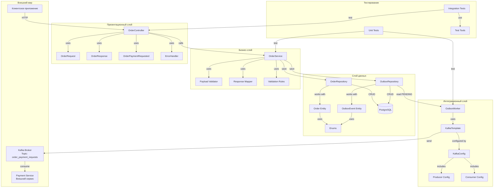
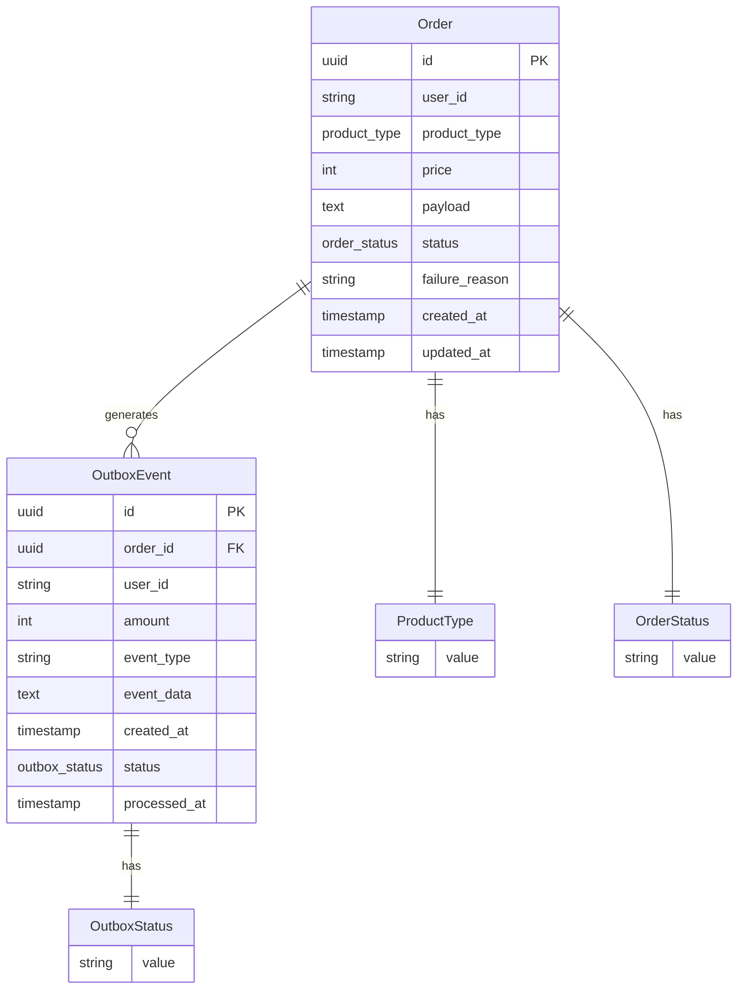
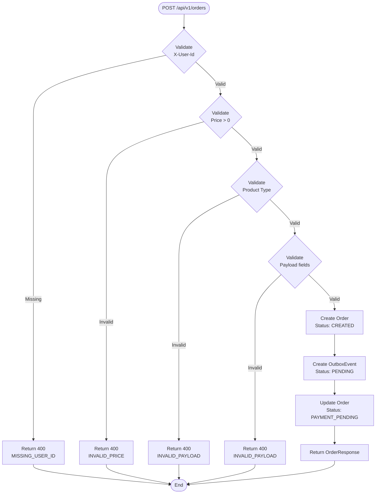
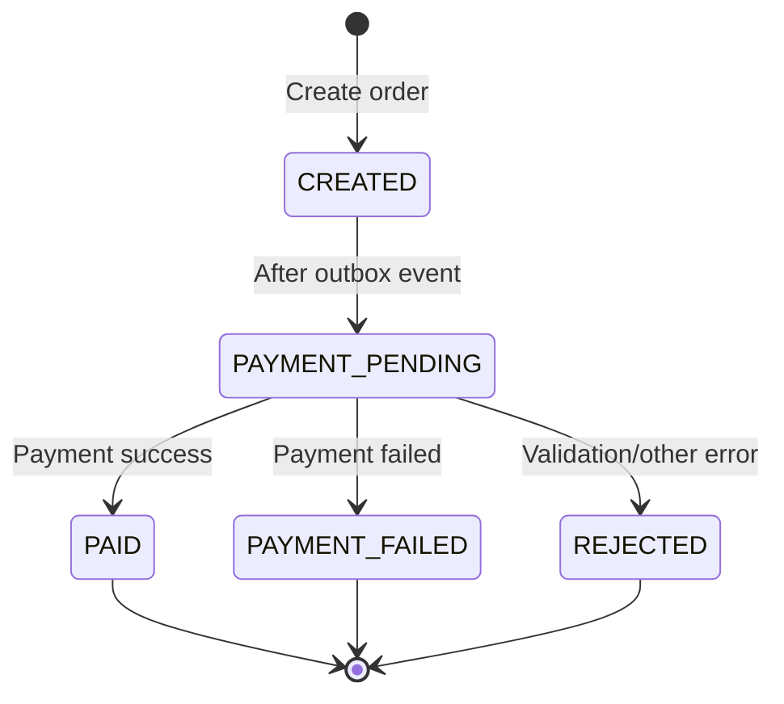
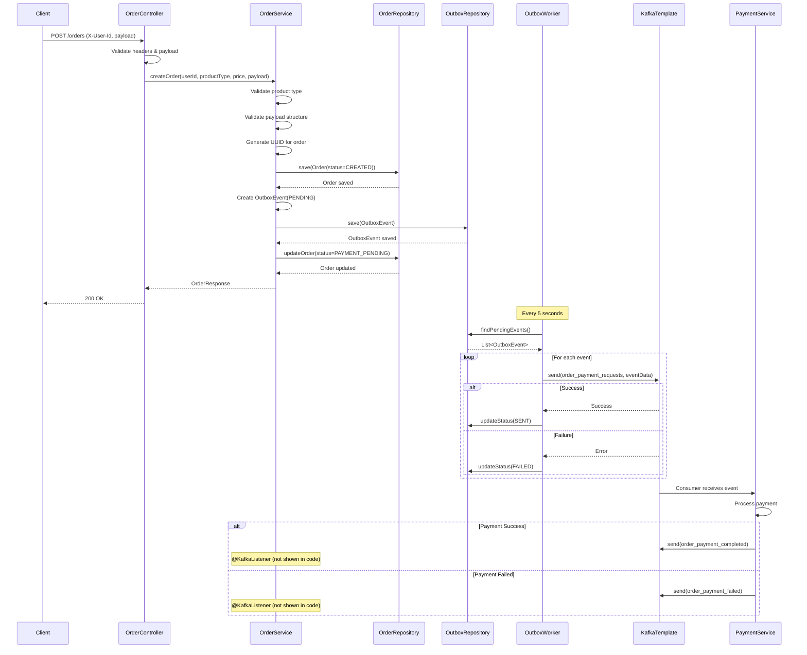

# Архитектура программы Orders Service

## Содержание

1. [Архитектура системы](#архитектура-системы)
1. [Схема модели данных](#схема-модели-данных)
1. [Схема потока создания заказа](#схема-потока-создания-заказа)
1. [Схема статусов заказа](#схема-статусов-заказа)
1. [Поток команд между компонентами](#поток-команд-между-компонентами)

## Архитектура системы



## Схема модели данных



### Таблица orders

Хранит информацию о заказах пользователей

| Поле           | Тип       | Описание                          | Пример                                                             |
| -------------- | --------- | --------------------------------- | ------------------------------------------------------------------ |
| id             | UUID      | Уникальный номер заказа           | `550e8400-e29b-41d4-a716-446655440000`                             |
| user_id        | String    | ID пользователя, кто создал заказ | `user-12345`                                                       |
| product_type   | Enum      | Тип продукта                      | `ARCHIVE`, `TASKING`, `MONITORING`                                 |
| price          | Integer   | Цена заказа                       | `1000`                                                             |
| payload        | TEXT      | Данные заказа (JSON)              | `{"aoi":"area1","capture_date":"2024-01-01"}`                      |
| status         | Enum      | Статус заказа                     | `CREATED`, `PAYMENT_PENDING`, `PAID`, `PAYMENT_FAILED`, `REJECTED` |
| failure_reason | String    | Причина ошибки (если есть)        | `Недостаточно средств`                                             |
| created_at     | Timestamp | Дата создания                     | `2024-01-01 10:00:00`                                              |
| updated_at     | Timestamp | Дата обновления                   | `2024-01-01 10:05:00`                                              |

### Таблица outbox_events

Хранит события, которые нужно отправить в Kafka

| Поле         | Тип       | Описание                     | Пример                                                   |
| ------------ | --------- | ---------------------------- | -------------------------------------------------------- |
| id           | UUID      | Уникальный номер события     | `550e8400-e29b-41d4-a716-446655440001`                   |
| order_id     | UUID      | ID заказа (ссылка на orders) | `550e8400-e29b-41d4-a716-446655440000`                   |
| user_id      | String    | ID пользователя              | `user-12345`                                             |
| amount       | Integer   | Сумма платежа                | `1000`                                                   |
| event_type   | String    | Тип события                  | `OrderPaymentRequested`                                  |
| event_data   | TEXT      | Данные события (JSON)        | `{"order_id":"...","amount":1000}`                       |
| created_at   | Timestamp | Дата создания                | `2024-01-01 10:00:00`                                    |
| status       | Enum      | Статус отправки              | `PENDING` (ждет), `SENT` (отправлено), `FAILED` (ошибка) |
| processed_at | Timestamp | Дата обработки               | `2024-01-01 10:00:05`                                    |

### ENUM

ProductType

1. ARCHIVE - Архивные данные (спутниковые снимки прошлых лет)
1. TASKING - Заказ на съемку (новые снимки)
1. MONITORING - Мониторинг (регулярные наблюдения)

OrderStatus

1. CREATED - Заказ создан
1. PAYMENT_PENDING - Ожидание оплаты
1. PAID - Оплачен
1. PAYMENT_FAILED - Оплата не прошла
1. REJECTED - Отклонен

OutboxStatus

1. PENDING - Ожидает отправки
1. SENT - Отправлено в Kafka
1. FAILED - Ошибка отправки

## Схема потока создания заказа



### Описание проверки (с примером)

Клиент отправляет запрос

```
POST /api/v1/orders
Заголовок: X-User-Id: user-123
Тело запроса:
{
  "product_type": "ARCHIVE",
  "price": 1000,
  "payload": {
    "aoi": "Москва",
    "capture_date": "2024-01-01",
    "sensor_type": "optical"
  }
}
```

| №   | Проверка     | Условие                        | Результат | Код ошибки        | HTTP статус     |
| --- | ------------ | ------------------------------ | --------- | ----------------- | --------------- |
| 1   | X-User-Id    | Отсутствует                    | Ошибка    | `MISSING_USER_ID` | 400 Bad Request |
| 1   | X-User-Id    | Присутствует                   | Успех     | -                 | -               |
| 2   | Price        | ≤ 0                            | Ошибка    | `INVALID_PRICE`   | 400 Bad Request |
| 2   | Price        | > 0                            | Успех     | -                 | -               |
| 3   | Product Type | Неизвестный тип                | Ошибка    | `INVALID_PAYLOAD` | 400 Bad Request |
| 3   | Product Type | ARCHIVE / TASKING / MONITORING | Успех     | -                 | -               |
| 4   | Payload      | Не хватает полей               | Ошибка    | `INVALID_PAYLOAD` | 400 Bad Request |
| 4   | Payload      | Все поля присутствуют          | Успех     | -                 | -               |

Проверка payload по типу продукта

| Тип продукта | Обязательные поля                        | Пример payload                                                                 |
| ------------ | ---------------------------------------- | ------------------------------------------------------------------------------ |
| ARCHIVE      | `aoi`<br>`capture_date`<br>`sensor_type` | `{"aoi":"Москва","capture_date":"2024-01-01","sensor_type":"optical"}`         |
| TASKING      | `aoi`<br>`time_window`<br>`sensor_type`  | `{"aoi":"Москва","time_window":"2024-01-01/2024-01-07","sensor_type":"radar"}` |
| MONITORING   | `aoi`<br>`cadence`<br>`duration_days`    | `{"aoi":"Москва","cadence":"DAILY","duration_days":30}`                        |

Ошибки валидации

| Код ошибки        | Сообщение                                                             | Причина                         | Решение                                       |
| ----------------- | --------------------------------------------------------------------- | ------------------------------- | --------------------------------------------- |
| `MISSING_USER_ID` | "X-User-Id header is required"                                        | Отсутствует заголовок X-User-Id | Добавить заголовок X-User-Id в запрос         |
| `INVALID_PRICE`   | "Price must be greater than zero"                                     | Цена меньше или равна 0         | Указать цену > 0                              |
| `INVALID_PAYLOAD` | "product_type is required"                                            | Пустой product_type             | Указать тип продукта                          |
| `INVALID_PAYLOAD` | "payload is required"                                                 | Отсутствует payload             | Добавить payload с данными                    |
| `INVALID_PAYLOAD` | "UNKNOWN_PRODUCT_TYPE"                                                | Неизвестный тип продукта        | Использовать: ARCHIVE, TASKING или MONITORING |
| `INVALID_PAYLOAD` | "Missing required fields for ARCHIVE: aoi, capture_date, sensor_type" | Не хватает полей для ARCHIVE    | Добавить все обязательные поля                |
| `INVALID_PAYLOAD` | "Missing required fields for TASKING: aoi, time_window, sensor_type"  | Не хватает полей для TASKING    | Добавить все обязательные поля                |
| `INVALID_PAYLOAD` | "Missing required fields for MONITORING: aoi, cadence, duration_days" | Не хватает полей для MONITORING | Добавить все обязательные поля                |
| `INTERNAL_ERROR`  | "Failed to create order: ..."                                         | Внутренняя ошибка сервера       | Проверить логи, обратиться к администратору   |

Статусы заказа после валидации

| Статус          | Описание        | Когда присваивается                              |
| --------------- | --------------- | ------------------------------------------------ |
| CREATED         | Заказ создан    | После успешной валидации, перед сохранением в БД |
| PAYMENT_PENDING | Ожидание оплаты | После сохранения заказа и Outbox события         |

## Схема статусов заказа



| Состояние       | Описание        | Когда наступает                                   | Действия пользователя                         |
| --------------- | --------------- | ------------------------------------------------- | --------------------------------------------- |
| CREATED         | Заказ создан    | После успешной валидации и сохранения в БД        | Ожидание обработки                            |
| PAYMENT_PENDING | Ожидание оплаты | После создания Outbox события                     | Ожидание ответа от платежной системы          |
| PAID            | Оплачен         | После успешной оплаты                             | Заказ выполнен, можно получить услугу         |
| PAYMENT_FAILED  | Ошибка оплаты   | Если платеж не прошел                             | Требуется повторить оплату или отменить заказ |
| REJECTED        | Отклонен        | При ошибке валидации или другой внутренней ошибке | Заказ отклонен, требуется создание нового     |

## Поток команд между компонентами



Краткая схема

```
Клиент -> Контроллер -> Сервис -> БД -> OutboxWorker -> Kafka -> PaymentService
```

Получение запроса

| Шаг | Кто        | Что делает                               |
| --- | ---------- | ---------------------------------------- |
| 1   | Клиент     | Отправляет POST запрос с данными заказа  |
| 2   | Контроллер | Проверяет заголовки и данные (валидация) |
| 3   | Контроллер | Передает запрос в Сервис                 |

Создание заказа

| Шаг | Кто    | Что делает                                          |
| --- | ------ | --------------------------------------------------- |
| 4   | Сервис | Проверяет тип продукта (ARCHIVE/TASKING/MONITORING) |
| 5   | Сервис | Проверяет структуру payload                         |
| 6   | Сервис | Создает уникальный ID для заказа                    |
| 7   | Сервис | Сохраняет заказ в БД (статус: CREATED)              |
| 8   | Сервис | Создает Outbox событие (статус: PENDING)            |
| 9   | Сервис | Сохраняет Outbox событие в БД                       |
| 10  | Сервис | Обновляет статус заказа (PAYMENT_PENDING)           |
| 11  | Сервис | Возвращает ответ клиенту                            |

Фоновая отправка

| Шаг | Кто          | Что делает                             |
| --- | ------------ | -------------------------------------- |
| 12  | OutboxWorker | Запускается каждые 5 секунд            |
| 13  | OutboxWorker | Ищет все события со статусом PENDING   |
| 14  | OutboxWorker | Для каждого события отправляет в Kafka |
| 15a | Kafka        | Успех -> статус меняется на SENT       |
| 15b | Kafka        | Ошибка -> статус меняется на FAILED    |

Обработка платежа

| Шаг | Кто            | Что делает                                    |
| --- | -------------- | --------------------------------------------- |
| 16  | PaymentService | Получает событие из Kafka                     |
| 17  | PaymentService | Обрабатывает платеж                           |
| 18a | PaymentService | Успех -> отправляет `order_payment_completed` |
| 18b | PaymentService | Ошибка -> отправляет `order_payment_failed`   |
