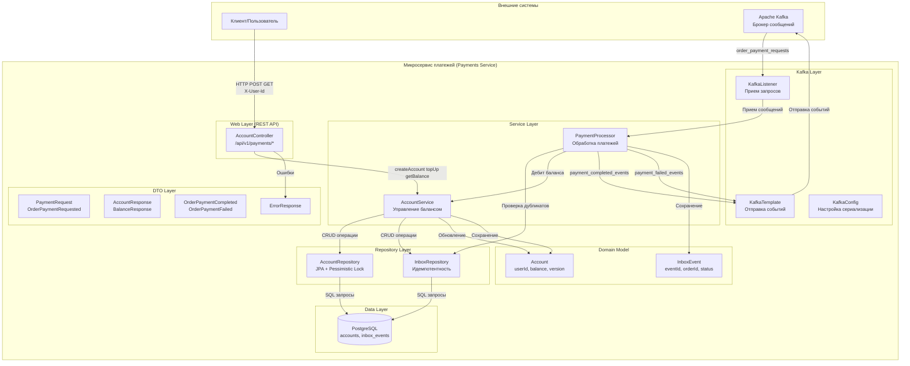

# Архитектура программы Payments Service

Основные компоненты:

1. Web Layer (REST API) - `AccountController`
   - 3 эндпоинта: создание аккаунта, пополнение, проверка баланса
   - Аутентификация через заголовок `X-User-Id`
   - Централизованная обработка ошибок

2. Service Layer
   - `AccountService`: бизнес-логика управления балансом с оптимистичной/пессимистичной блокировкой
   - `PaymentProcessor`: обработка асинхронных платежей из Kafka с идемпотентностью

3. Repository Layer
   - `AccountRepository`: JPA + `@Lock(LockModeType.PESSIMISTIC_WRITE)` для конкурентного доступа
   - `InboxRepository`: проверка дубликатов для идемпотентной обработки

4. Kafka Integration
   - Consumer: `order_payment_requests` → дебит баланса
   - Producer: `payment_completed_events` / `payment_failed_events`

5. Схема БД
   - `accounts`: баланс + `version` для optimistic lock
   - `inbox_events`: идемпотентность (status: PENDING/PROCESSED/FAILED)

Паттерны:

- Idempotent Consumer через Inbox таблицу
- Transactional Outbox для атомарности
- Pessimistic Locking для конкурентного дебита
