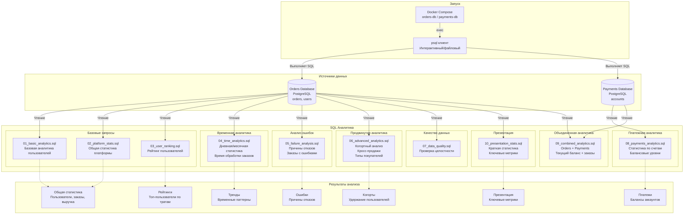

# Архитектура программы SQL

Структура запросов

| Категория             | Файлы      | Описание                                      |
| --------------------- | ---------- | --------------------------------------------- |
| **Базовая аналитика** | 01, 02, 03 | Статистика пользователей, платформы, рейтинги |
| **Временная**         | 04         | Дневная/месячная динамика, время обработки    |
| **Ошибки**            | 05         | Причины отказов, анализ неуспешных заказов    |
| **Продвинутая**       | 06         | Когорты, кросс-продажи, типы покупателей      |
| **Качество**          | 07         | Проверка целостности данных                   |
| **Платежи**           | 08         | Статистика счетов, балансовые уровни          |
| **Объединенная**      | 09         | Orders + Payments вместе                      |
| **Презентация**       | 10         | Ключевые метрики для отчетов                  |

Метрики

| Метрика              | Источник | Описание                            |
| -------------------- | -------- | ----------------------------------- |
| Total Users          | orders   | Количество уникальных пользователей |
| Total Revenue        | orders   | Сумма оплаченных заказов            |
| Success Rate         | orders   | Доля успешных платежей              |
| Avg Order Value      | orders   | Средний чек                         |
| Top Users            | orders   | Рейтинг пользователей по тратам     |
| Balance Distribution | accounts | Распределение балансов              |
