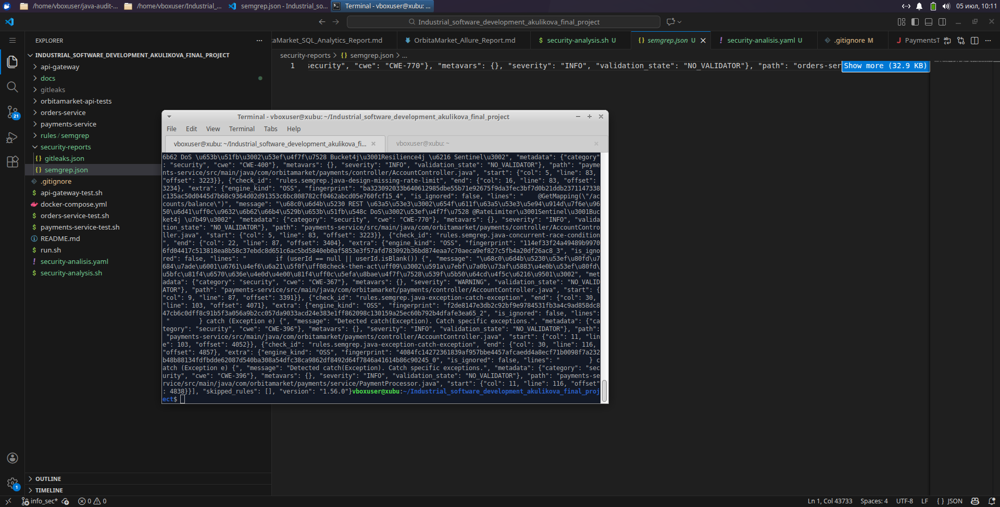

# Отчет по результатам статического анализа кода Semgrep



Запуск анализа

```bash
./security-analysis.sh
```

Скрипт автоматически устанавливает Semgrep, Gitleaks (через Go) и jq , после чего запускает сканирование кода с фиксированным набором из 10 правил безопасности для Java (включая API Security, Config, Crypto, RCE, SQLi, SSRF и другие), сохраняя результаты в security-reports/.

Сами правила лежат по следующему пути [../../rules/semgrep/](../../rules/semgrep/)

## Содержание

1. [Таблица триажа](#таблица-триажа)
1. [Разбор находок](#разбор-находок)
1. [Общая таблица](#общая-таблица)

## Таблица триажа

| ID  | Инструмент | Находка                                                                     | Критичность | TP / FP / Риск     | Решение                                                                                                                                                                                                          |
| --- | ---------- | --------------------------------------------------------------------------- | ----------- | ------------------ | ---------------------------------------------------------------------------------------------------------------------------------------------------------------------------------------------------------------- |
| 1   | Semgrep    | Отсутствие Rate Limiting в `OrderController`                                | Низкая      | TP (Risk Accepted) | Добавить `@RateLimiter` или использовать Resilience4j для защиты эндпоинтов. В текущей MVP-версии риск DoS приемлем. Запланировать на доработку.                                                                 |
| 2   | Semgrep    | Race Condition (check-then-act) при проверке `userId` в `OrderController`   | Средняя     | FP                 | Метод контроллера выполняется в одном потоке на запрос. Проверка заголовка происходит до вызова сервиса, состояние гонки невозможно в рамках одного HTTP-запроса.                                                |
| 3   | Semgrep    | Отсутствие идемпотентности при создании заказа                              | Высокая     | TP                 | Реализовать механизм идемпотентности через `Idempotency-Key` в заголовке запроса. Хранить ключи в Redis или БД с TTL. Приоритет - высокий.                                                                       |
| 4   | Semgrep    | Перехват общего исключения `Exception` в `OrderController`                  | Низкая      | TP (Risk Accepted) | Заменить на конкретные исключения (`IllegalArgumentException`, `JsonProcessingException`, `DataAccessException`) для корректной обработки. В текущей версии приемлемо.                                           |
| 5   | Semgrep    | Неполный switch по `ProductType` в `OrderService`                           | Низкая      | TP                 | Добавить `default` ветку или убедиться, что все enum значения обработаны. В текущей реализации только три типа, но для безопасности добавить `default` с throw.                                                  |
| 6   | Semgrep    | Отсутствие Rate Limiting в `AccountController`                              | Низкая      | TP (Risk Accepted) | Аналогично Orders Service. Эндпоинты пополнения баланса особенно чувствительны. Запланировать внедрение ограничений.                                                                                             |
| 7   | Semgrep    | Race Condition (check-then-act) при проверке `amount` в `AccountController` | Средняя     | FP                 | Проверка выполняется в контроллере, метод сервиса использует пессимистичную блокировку (`@Lock(LockModeType.PESSIMISTIC_WRITE)`). Состояние гонки исключено на уровне БД.                                        |
| 8   | Semgrep    | Перехват общего исключения `Exception` в `PaymentProcessor`                 | Средняя     | TP                 | В Kafka listener критично обрабатывать конкретные исключения. Перехват `Exception` может скрыть серьезные проблемы. Рекомендуется разделить обработку на `JsonProcessingException`, `DataAccessException` и т.д. |

## Разбор находок

### 1. Отсутствие Rate Limiting

Проблема: Отсутствие ограничения частоты запросов на REST эндпоинтах.

Критичность: Низкая

Комментарий: В текущей реализации приложение уязвимо к DoS-атакам через массовые запросы на создание заказов или пополнение баланса. Однако учитывая, что это MVP-версия с ограниченным количеством пользователей, риск признан приемлемым. В production необходимо внедрить механизмы rate limiting через:

- Spring Gateway с фильтрами
- Resilience4j RateLimiter
- Redis + Bucket4j

### 2. Отсутствие идемпотентности при создании заказа

Проблема: Повторные запросы с одинаковыми данными могут создать несколько заказов.

Критичность: Высокая

Комментарий: Это реальная уязвимость. При сбоях на стороне клиента или повторных попытках отправки запроса возможны дубликаты заказов. Рекомендуется реализовать идемпотентность через заголовок `Idempotency-Key`:

### 3. Перехват общего исключения `Exception`

Проблема: Использование `catch (Exception e)` маскирует специфические ошибки и усложняет отладку.

Критичность: Средняя (для PaymentProcessor) / Низкая (для контроллеров)

Комментарий: В `PaymentProcessor` это особенно критично, так как ошибка в Kafka listener может привести к неправильной обработке событий. Рекомендуется:

### 4. Race Condition - FP разбор

Проблема: Semgrep обнаружил паттерн "check-then-act" в контроллерах.

Критичность: Нет

Комментарий: В обоих случаях проверки выполняются в контроллере на уровне HTTP-запроса. Каждый запрос обрабатывается в отдельном потоке, и состояние гонки невозможно в рамках одного запроса:

- Проверка `userId` на null не является критической операцией
- Проверка `amount` в `AccountController` дублируется, но основная логика защищена пессимистичной блокировкой в `AccountService.debitBalance()`

### 5. Неполный switch

Проблема: Switch по `ProductType` не покрывает все возможные случаи.

Критичность: Низкая

Комментарий: Хотя в системе определено только три типа продуктов (`ARCHIVE`, `TASKING`, `MONITORING`), при добавлении нового типа switch может вызвать `MatchException` (Java 17+).

## Общая таблица

| Файл                                                   | Строка | Тип правила                   | Степень   | CWE     | Описание                                                                                                                                                              |
| :----------------------------------------------------- | :----- | :---------------------------- | :-------- | :------ | :-------------------------------------------------------------------------------------------------------------------------------------------------------------------- |
| orders-service/.../controller/OrderController.java     | 6      | Jakarta Servlet/Filter        | `INFO`    | CWE-284 | Обнаружено использование `jakarta.servlet` (Spring Boot 3.x). Убедитесь в корректной настройке безопасности.                                                          |
|                                                        | 6      | Jakarta Servlet Filter Config | `INFO`    | CWE-287 | Обнаружено использование Jakarta Servlet. Убедитесь, что фильтры настроены правильно, чтобы избежать обхода аутентификации.                                           |
|                                                        | 18     | Missing Rate Limit            | `INFO`    | CWE-400 | Для REST контроллера (`@RestController`) рекомендуется настроить ограничение частоты запросов (rate limit) для защиты от DoS-атак.                                    |
|                                                        | 18     | Missing Rate Limit            | `INFO`    | CWE-770 | Чувствительный REST эндпоинт должен быть защищен ограничением частоты запросов для предотвращения brute-force и DoS-атак.                                             |
|                                                        | 19     | Missing Rate Limit            | `INFO`    | CWE-400 | Для маппинга `/api/v1/orders` рекомендуется настроить ограничение частоты запросов (rate limit).                                                                      |
|                                                        | 19     | Missing Rate Limit            | `INFO`    | CWE-770 | Чувствительный REST эндпоинт должен быть защищен ограничением частоты запросов.                                                                                       |
|                                                        | 25     | Missing Rate Limit            | `INFO`    | CWE-400 | Для метода `@PostMapping` рекомендуется настроить ограничение частоты запросов (rate limit).                                                                          |
|                                                        | 25     | Missing Rate Limit            | `INFO`    | CWE-770 | Чувствительный REST эндпоинт должен быть защищен ограничением частоты запросов.                                                                                       |
|                                                        | 26     | Missing Idempotency (Order)   | `INFO`    | CWE-668 | Для операции создания заказа (`createOrder`) необходима идемпотентность, чтобы избежать дублирования.                                                                 |
|                                                        | 31     | Race Condition                | `WARNING` | CWE-367 | Обнаружен потенциальный паттерн "проверка-затем-действие" (check-then-act) при проверке `userId`. Возможно состояние гонки.                                           |
|                                                        | 36     | Race Condition                | `WARNING` | CWE-367 | Обнаружен паттерн "check-then-act" при проверке `price`. Возможно состояние гонки.                                                                                    |
|                                                        | 41     | Race Condition                | `WARNING` | CWE-367 | Обнаружен паттерн "check-then-act" при проверке `productType`. Возможно состояние гонки.                                                                              |
|                                                        | 46     | Race Condition                | `WARNING` | CWE-367 | Обнаружен паттерн "check-then-act" при проверке `payload`. Возможно состояние гонки.                                                                                  |
|                                                        | 52     | Missing Idempotency (Order)   | `INFO`    | CWE-668 | Вызов `orderService.createOrder` должен быть идемпотентным для предотвращения повторных заказов.                                                                      |
|                                                        | 61     | Catch Exception               | `INFO`    | CWE-396 | Используется перехват общего исключения `Exception`. Рекомендуется перехватывать конкретные типы исключений.                                                          |
|                                                        | 67     | Missing Rate Limit            | `INFO`    | CWE-400 | Для метода `@GetMapping` рекомендуется настроить ограничение частоты запросов (rate limit).                                                                           |
|                                                        | 67     | Missing Rate Limit            | `INFO`    | CWE-770 | Чувствительный REST эндпоинт должен быть защищен ограничением частоты запросов.                                                                                       |
|                                                        | 71     | Race Condition                | `WARNING` | CWE-367 | Обнаружен паттерн "check-then-act" при проверке `userId`. Возможно состояние гонки.                                                                                   |
|                                                        | 79     | Catch Exception               | `INFO`    | CWE-396 | Используется перехват общего исключения `Exception`. Рекомендуется перехватывать конкретные типы исключений.                                                          |
|                                                        | 85     | Missing Rate Limit            | `INFO`    | CWE-400 | Для метода `@GetMapping("/{orderId}")` рекомендуется настроить ограничение частоты запросов (rate limit).                                                             |
|                                                        | 85     | Missing Rate Limit            | `INFO`    | CWE-770 | Чувствительный REST эндпоинт должен быть защищен ограничением частоты запросов.                                                                                       |
|                                                        | 91     | Race Condition                | `WARNING` | CWE-367 | Обнаружен паттерн "check-then-act" при проверке `userId`. Возможно состояние гонки.                                                                                   |
|                                                        | 98     | Race Condition                | `WARNING` | CWE-367 | Обнаружен паттерн "check-then-act" при проверке `order == null`. Возможно состояние гонки.                                                                            |
| orders-service/.../service/OrderService.java           | 35     | Missing Idempotency (Order)   | `INFO`    | CWE-668 | Метод `createOrder` должен быть идемпотентным для предотвращения дублирования заказов.                                                                                |
|                                                        | 114    | Exhaustive Switch             | `INFO`    | CWE-478 | Обнаружен оператор `switch` без покрытия всех случаев. Рекомендуется убедиться, что обработаны все возможные значения `ProductType`, чтобы избежать `MatchException`. |
|                                                        | 150    | Race Condition                | `WARNING` | CWE-367 | Обнаружен паттерн "check-then-act" при проверке `order == null`. Возможно состояние гонки.                                                                            |
| orders-service/.../service/OutboxWorker.java           | 51     | Catch Exception               | `INFO`    | CWE-396 | Используется перехват общего исключения `Exception`. Рекомендуется перехватывать конкретные типы исключений.                                                          |
| payments-service/.../controller/AccountController.java | 9      | Jakarta Servlet/Filter        | `INFO`    | CWE-284 | Обнаружено использование `jakarta.servlet` (Spring Boot 3.x). Убедитесь в корректной настройке безопасности.                                                          |
|                                                        | 9      | Jakarta Servlet Filter Config | `INFO`    | CWE-287 | Обнаружено использование Jakarta Servlet. Убедитесь, что фильтры настроены правильно, чтобы избежать обхода аутентификации.                                           |
|                                                        | 17     | Missing Rate Limit            | `INFO`    | CWE-400 | Для REST контроллера (`@RestController`) рекомендуется настроить ограничение частоты запросов (rate limit).                                                           |
|                                                        | 17     | Missing Rate Limit            | `INFO`    | CWE-770 | Чувствительный REST эндпоинт должен быть защищен ограничением частоты запросов.                                                                                       |
|                                                        | 18     | Missing Rate Limit            | `INFO`    | CWE-400 | Для маппинга `/api/v1/payments` рекомендуется настроить ограничение частоты запросов (rate limit).                                                                    |
|                                                        | 18     | Missing Rate Limit            | `INFO`    | CWE-770 | Чувствительный REST эндпоинт должен быть защищен ограничением частоты запросов.                                                                                       |
|                                                        | 24     | Missing Rate Limit            | `INFO`    | CWE-400 | Для метода `@PostMapping("/accounts")` рекомендуется настроить ограничение частоты запросов.                                                                          |
|                                                        | 24     | Missing Rate Limit            | `INFO`    | CWE-770 | Чувствительный REST эндпоинт должен быть защищен ограничением частоты запросов.                                                                                       |
|                                                        | 28     | Race Condition                | `WARNING` | CWE-367 | Обнаружен паттерн "check-then-act" при проверке `userId`. Возможно состояние гонки.                                                                                   |
|                                                        | 44     | Catch Exception               | `INFO`    | CWE-396 | Используется перехват общего исключения `Exception`. Рекомендуется перехватывать конкретные типы исключений.                                                          |
|                                                        | 50     | Missing Rate Limit            | `INFO`    | CWE-400 | Для метода `@PostMapping("/accounts/top-up")` рекомендуется настроить ограничение частоты запросов.                                                                   |
|                                                        | 50     | Missing Rate Limit            | `INFO`    | CWE-770 | Чувствительный REST эндпоинт должен быть защищен ограничением частоты запросов.                                                                                       |
|                                                        | 56     | Race Condition                | `WARNING` | CWE-367 | Обнаружен паттерн "check-then-act" при проверке `userId`. Возможно состояние гонки.                                                                                   |
|                                                        | 61     | Race Condition                | `WARNING` | CWE-367 | Обнаружен паттерн "check-then-act" при проверке `amount`. Возможно состояние гонки.                                                                                   |
|                                                        | 77     | Catch Exception               | `INFO`    | CWE-396 | Используется перехват общего исключения `Exception`. Рекомендуется перехватывать конкретные типы исключений.                                                          |
|                                                        | 83     | Missing Rate Limit            | `INFO`    | CWE-400 | Для метода `@GetMapping("/accounts/balance")` рекомендуется настроить ограничение частоты запросов.                                                                   |
|                                                        | 83     | Missing Rate Limit            | `INFO`    | CWE-770 | Чувствительный REST эндпоинт должен быть защищен ограничением частоты запросов.                                                                                       |
|                                                        | 87     | Race Condition                | `WARNING` | CWE-367 | Обнаружен паттерн "check-then-act" при проверке `userId`. Возможно состояние гонки.                                                                                   |
|                                                        | 103    | Catch Exception               | `INFO`    | CWE-396 | Используется перехват общего исключения `Exception`. Рекомендуется перехватывать конкретные типы исключений.                                                          |
| payments-service/.../service/PaymentProcessor.java     | 116    | Catch Exception               | `INFO`    | CWE-396 | Используется перехват общего исключения `Exception`. Рекомендуется перехватывать конкретные типы исключений.                                                          |
